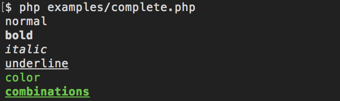

# Crayon [](https://travis-ci.org/troublete/crayon)
> A simple functional PHP library for formatting string output 🌈



## Install

```bash
$ composer require troublete/crayon
```

## Introduction

The purpose of the library is to simplify the usage of formatting of strings on the PHP CLI.
The usage should be strictly a functional one, to write the least code with the biggest impact.
Simple use the function `Crayon\text` which returns a `Crayon\Font` instance which handles the formatting
and return as string. Formatting calls may be chained.

> ⚠️ Be aware that there is a formatting order: underline > italic > bold > color.
> Last color set will be used and that italic weighs more than bold formatting. So if both
> options are set the prior one will be used.

## Usage

```php
<?php
require_once 'path/to/vendor/autoload.php';

use function Crayon\text as crayon;

echo crayon('text')->green(); // returns green text
echo crayon('text')->green()->bold(); // returns bold green text
echo crayon('text')->green()->underline()->bold(); // returns underlined bold green text
```

## API

### `Crayon\Font`

#### `->bold()` – sets text bold

#### `->italic()` – sets text italic

#### `->underline()` – sets text underlined

#### `->red()` – sets text color to red

#### `->green()` – sets text color to green

#### `->yellow()` – sets text color to yellow

#### `->blue()` – sets text color to blue

#### `->magenta()` – sets text color to magenta

#### `->cyan()` – sets text color to cyan

## License

GPL-2.0 © Willi Eßer